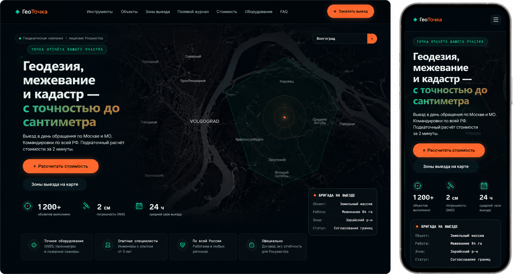

# ГеоТочка — лендинг геодезической компании

Одностраничный сайт геодезической компании, оформленный как «рабочий стол
геодезиста»: центральный элемент — полноэкранная Leaflet-карта, а секции
поданы как панели-инструменты бригады (тахеометр, GNSS, нивелир, дрон),
полевой журнал наблюдений и парк приборов с заявленной точностью.

Дизайн — топо-картографическая тёмная тема с «чертёжным» языком: тонкие
линии, засечки, горизонтали как декор, моноширинный шрифт для полевых
данных (координаты, пикеты, отсчёты по рейке). Акценты — оранжевый
геодезиста и геодезическая зелень.

## 🖼 Превью



<video src="geodot.mp4" controls muted width="100%"></video>

## ✨ Что внутри

- **Hero = карта** — полноэкранная Leaflet-карта с зонами обслуживания
  (GeoJSON-полигоны), плавающий оверлей с заголовком и CTA, живая карточка
  «бригада на выезде», поиск точки по координатам или адресу (через
  Nominatim OSM) с авто-определением зоны (`src/js/map.js`).
- **Инструменты бригады** — вместо плитки «услуги» карточки-инструменты
  (тахеометр, GNSS RTK, нивелир, БПЛА-фотограмметрия) с shortcode-командами
  (`TRAV`, `MEAS`, `STAK`, `BASE`, `ROVER`…) и спецификацией точности
  (`src/js/sections.js` + `INSTRUMENTS` в `data.js`).
- **Выполненные объекты** — карточки с процедурно генерируемыми
  категорийными SVG-рисунками (топосъёмка / межевание / линейные / вынос /
  объёмы), фильтры по типу работ, модальное окно с мини-картой объекта на
  Leaflet (`src/js/objects.js` + `src/data/objects.json`).
- **Зоны обслуживания** — отдельная интерактивная карта с переключателями
  зон, расцветкой по тарифам, попапами с тарифом и временем реакции
  (`src/js/zones.js` + `src/data/zones.geojson`).
- **Полевой журнал** — объединённая секция: слева этапы работ как записи
  полевого журнала (`REQ → RECON → FIELD → OFFICE → DELIVER`), справа
  бортовой журнал бригад — вертикальный live-фид с координатами, статусом,
  километражем от базы и таблица пикетов (пикет, дата/время, станция,
  отсчёт по рейке) (`src/js/sections.js` + `ticker.js`,
  `FIELDLOG_*` и `LIVE_BRIGADE` в `data.js`).
- **Калькулятор стоимости** — выбор типа работ, площади/количества,
  срочности и зоны → интерактивный расчёт диапазона цены с breakdown по
  компонентам (`src/js/calculator.js`).
- **Оборудование / точность приборов** — вместо пустой секции «преимуществ»
  таблица парка приборов: модель, тип, заявленная точность, область
  применения (`src/js/sections.js` + `EQUIPMENT` в `data.js`).
- **FAQ** — аккордеон с поиском (`src/js/faq.js`).
- **Форма заявки** — имя, телефон, тип работ, адрес объекта, площадь →
  отправка в Telegram (Bot API) + email (mock/Formspree) (`src/js/form.js`).
- **Полный SEO**: `robots.txt`, `sitemap.xml`, Open Graph/Twitter, JSON-LD
  `LocalBusiness`, semantic HTML.
- **Аналитика** — mock gtag/dataLayer, трекинг кликов и событий
  (`src/js/analytics.js`).
- **Гео-специфичные интерактивы**:
  - **Прелоадер «калибровка тахеометра»** — круговая юстировка с ретиклом,
    badge-статусами (`GPS LOCK`, `BASE+ROVER`, `RMSE 0.012 м`) и
    прогресс-баром (`src/js/preloader.js`).
  - **Кастомный курсор-crosshair** — «прицел» геодезиста (`src/js/cursor.js`).
  - **Crosshair-наведение** — вместо магнитных кнопок: угловые засечки и
    ведомый ретикл, активация по наведению точки прицела (`src/js/magnetic.js`,
    `initCrosshairAim`).
  - **Облако точек** — вместо 3D-наклона карточек: при hover карточка
    параллаксит как 3D-модель рельефа (`src/js/cards-tilt.js`,
    `initPointcloud`).
  - **Бортовой журнал бригад** — вместо бегущей строки: автопрокручиваемый
    live-фид с координатами, статусом и км от базы, ротация карточки
    «бригада на выезде» (`src/js/ticker.js`).
  - Scroll-анимации (IntersectionObserver), счётчики (`src/js/animations.js`).
- **Адаптивность** — бургер-меню, брейкпоинты в SCSS, корректное
  `invalidateSize()` карт при ресайзе и попадании в видимую область.

## 🛠 Технологии

| Категория   | Технологии                          |
|-------------|-------------------------------------|
| Сборка      | Vite 5                              |
| Стили       | SCSS (один `main.scss`, без libs)   |
| Скрипты     | Vanilla JS (ES-модули)              |
| Карты       | Leaflet 1.9 + CARTO Dark Matter tiles |
| Данные      | GeoJSON зон, JSON объектов          |
| Формы       | Telegram Bot API + Email mock       |
| Шрифты      | Space Grotesk, Inter, JetBrains Mono |

Рантайм-зависимость — только `leaflet`. Остальное dev-зависимости.

## 📁 Структура

```
site2-geo/
├── public/
│   ├── robots.txt
│   └── sitemap.xml
├── src/
│   ├── data/
│   │   ├── zones.geojson        # полигоны зон (4 зоны)
│   │   └── objects.json         # реестр выполненных объектов (с category)
│   ├── js/
│   │   ├── main.js              # точка входа, инициализация модулей
│   │   ├── map.js               # hero-карта + общие хелперы Leaflet
│   │   ├── zones.js             # карта зон с переключателями
│   │   ├── objects.js           # карточки + категорийные SVG + модал-карта
│   │   ├── calculator.js        # калькулятор стоимости
│   │   ├── sections.js          # рендер instruments / equipment / fieldlog
│   │   ├── ticker.js            # бортовой журнал бригад + live-карточка
│   │   ├── faq.js               # аккордеон FAQ + поиск
│   │   ├── form.js              # заявка → Telegram + Email
│   │   ├── analytics.js         # mock gtag/dataLayer
│   │   ├── cursor.js            # кастомный курсор crosshair
│   │   ├── preloader.js         # прелоадер «калибровка тахеометра»
│   │   ├── animations.js        # reveal + счётчики
│   │   ├── magnetic.js          # crosshair-наведение (initCrosshairAim)
│   │   ├── cards-tilt.js        # облако точек parallax (initPointcloud)
│   │   └── data.js              # все статические данные секций
│   ├── scss/
│   │   └── main.scss            # все стили + overrides Leaflet
│   └── assets/images/
├── index.html                   # разметка всех секций + модалка
├── .env.example
├── .gitignore
├── vite.config.js
└── package.json
```

### Секции лендинга (`index.html`)

1. `#hero` — полноэкранная карта + оверлей
2. `#instruments` — инструменты бригады (бывшие services)
3. `#objects` — выполненные объекты + модал-карта
4. `#zones` — интерактивная карта зон
5. `#fieldlog` — полевой журнал: этапы + бортовой журнал бригад
6. `#calculator` — калькулятор стоимости
7. `#equipment` — парк приборов и точность (вместо advantages)
8. `#faq` — частые вопросы
9. `#contact` — форма заявки на полевые работы

## 🚀 Установка и запуск

Требуется Node.js 18+.

```bash
npm install
cp .env.example .env     # при необходимости пропишите токены (см. ниже)
npm run dev              # dev-сервер
npm run build            # сборка в dist/
npm run preview          # предпросмотр сборки
```

## ⚙️ Конфигурация (.env)

Все переменные опциональны — без них сайт работает на заглушках/mock.

```env
# Telegram: куда падают заявки с формы
VITE_TELEGRAM_BOT_TOKEN=
VITE_TELEGRAM_CHAT_ID=

# Email: endpoint сервиса-relay (например Formspree/Web3Forms). Без значения — mock в console.
VITE_EMAIL_ENDPOINT=
```

### Telegram

1. Создайте бота через [@BotFather](https://t.me/BotFather) → токен.
2. Узнайте `chat_id` через [@userinfobot](https://t.me/userinfobot) или ID группы.
3. Подставьте в `.env` (или прямо в `src/js/form.js`).

Пока значения плейсхолдеры — форма имитирует успешную отправку.

## 🎨 Дизайн

Топо-картографическая тёмная тема, «чертёжный» язык (тонкие линии, засечки,
без неонового glow):

|            | Значение             |
|------------|----------------------|
| Фон        | `#0b1418`            |
| Surface    | `#0f1c20`            |
| Текст      | `#e6f0ee`            |
| Акцент 1   | `#ff6b35` (orange)   |
| Акцент 2   | `#2dd4a7` (geode)    |
| Акцент 3   | `#3ba9d4` (map blue) |

Градиент: `linear-gradient(135deg, #2dd4a7, #ff6b35)`.
Фон страницы — топо-контуры (горизонтали) и сетка пикетов на SVG/CSS.
Моноширинный шрифт (`JetBrains Mono`) — для всех «полевых» данных:
координаты, отсчёты по рейке, пикеты, shortcode-команды приборов.

## 🧭 Идентичность

Сайт оформлен как **«геодезический кабинет»** — рабочий стол геодезиста:

- **Инструменты** вместо плитки услуг — карточки-приборы с shortcode-командами.
- **Полевой журнал** вместо таймлайна «процесс» — таблица пикетов и
  бортовой журнал бригад с координатами.
- **Оборудование** вместо «преимуществ» — конкретные модели и точность.
- **Прелоадер** — калибровка тахеометра, а не терминал-журнал.
- **Crosshair-наведение** вместо магнитных кнопок.
- **Облако точек** вместо 3D-наклона карточек.

Это разводит визуал с шаблонными лендингами и приводит его в соответствие
с геодезической тематикой.

## 🎯 Главная аудитория → лиды

- Карта задерживает внимание и даёт ощущение мгновенной пользы (зона и
  тариф по клику, поиск по адресу).
- Калькулятор даёт прозрачность по цене и отводит страх «скрытых» счетов.
- Карточка «бригада на выезде» и бортовой журнал создают ощущение
  активности и реальности компании.
- Все CTA ведут в одну точку: форму заявки на полевые работы.

## 📄 Лицензия

© 2026. Все права защищены.
